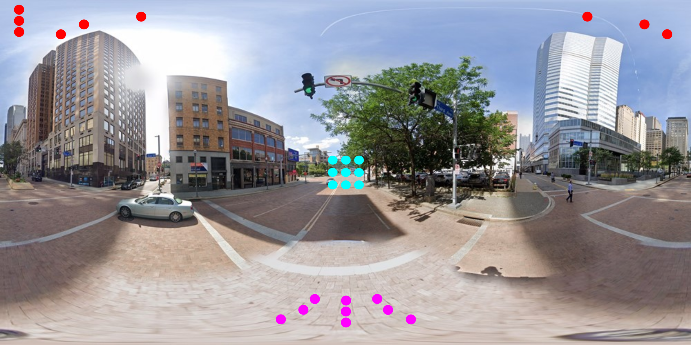

# Semantic segmentation of outdoor panoramic images
This repository contains semantically annotated outdoor panoramic image dataset, Pytorch implementation of UNet-stdconv and UNet-equiconv.

You can reach the paper via SharedIt link: https://rdcu.be/ct4IC or via Springer link: http://link.springer.com/article/10.1007/s11760-021-02003-3


<p align="center">

</p>

## Citation
If you find this repository is useful for your work, please cite our paper:
```bibtex
@article{orhan2021semantic,
  title={Semantic segmentation of outdoor panoramic images},
  author={Orhan, Semih and Bastanlar, Yalin},
  journal={Signal, Image and Video Processing},
  year={2021},
  publisher={Springer}
}
```

## Installation
Install python requirements:
```bash
  $ pip install -r requirements.txt
```



## Dataset
CVRG-Pano is a semantically annotated outdoor panoramic image dataset. The dataset consists of pixel-level annotated 600 images. We defined 20 semantic classes and grouped them into 7 categories as shown in the table below.

| Category| Class Name |
|---|---|
| Flat  | Ground, road, sidewalk, parking  |
| Construction  | Building, wall, fence, bridge |
| Object  | Pole, traffic light, traffic sign  |
|  Nature | Vegetation, terrain |
|  Sky | Sky |
|  Person | Person  |
|  Vehicle | Car, truck, bus, motorcycle, bicycle  | 

You can download the dataset with the following link:
CVRG-Pano: [download](https://drive.google.com/drive/folders/1da-KdQfL4615F5quhrW9e4pFFA0hyrKX?usp=sharing)

## Models
UNet-stdconv: [download](https://drive.google.com/drive/folders/1btKLfxY7ZMZ-Oc-wLDyz7GUHMzgGDTn3?usp=sharing)

UNet-equiconv: [download](https://drive.google.com/drive/folders/1EqgKfv_M4Olg7qh1W8H5uQfPLDH0ERvw?usp=sharing)

## Test

```bash
  $ python test.py

```
